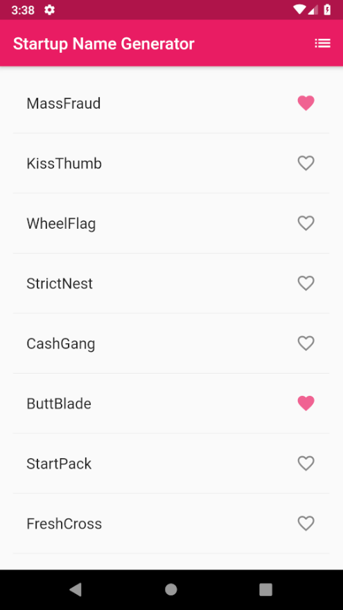
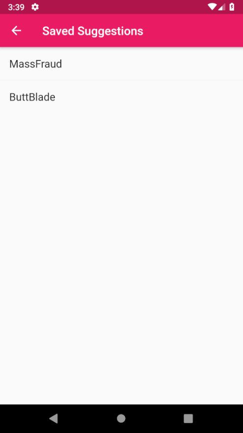

# startup_namer

A Flutter project created by following [Lab: Write your first Flutter app](https://flutter.dev/docs/get-started/codelab).
Changes that I made were the primaryColor and accentColor.

I learned:
* how to create a flutter project
* how to use themes in flutter
* some Dart syntax
* how to run flutter apps on an Android Virtual Device, as well as a physical device.

